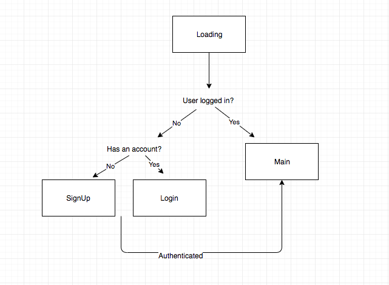
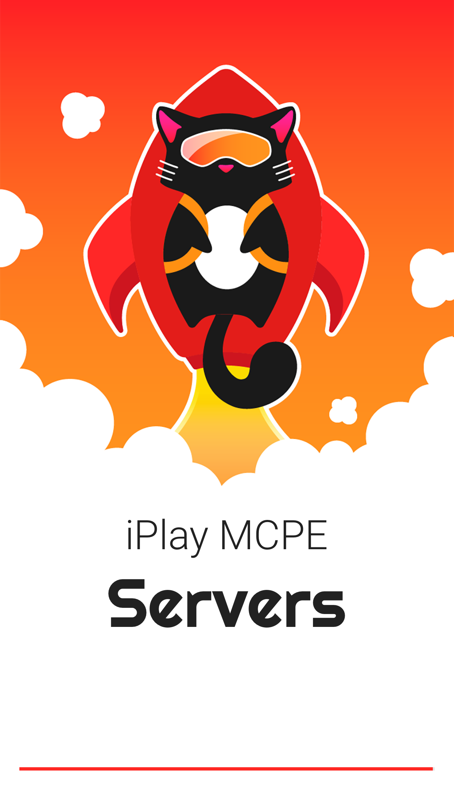
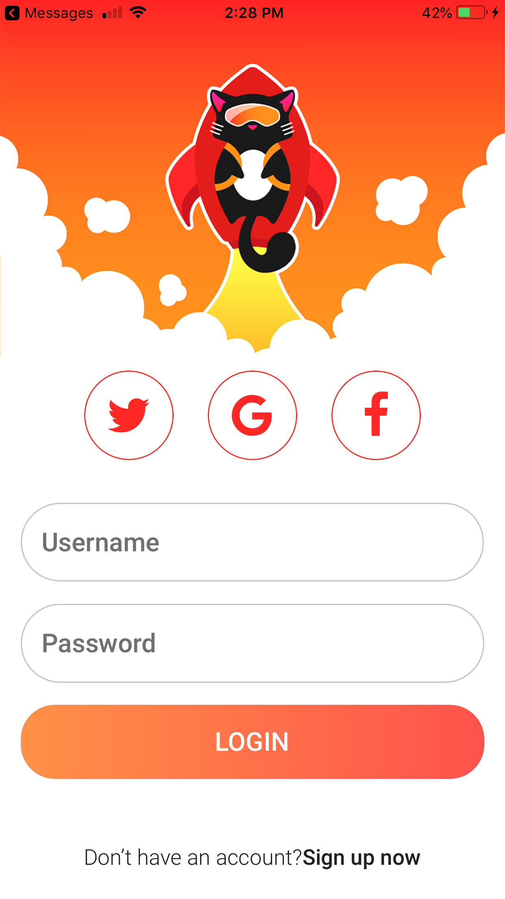
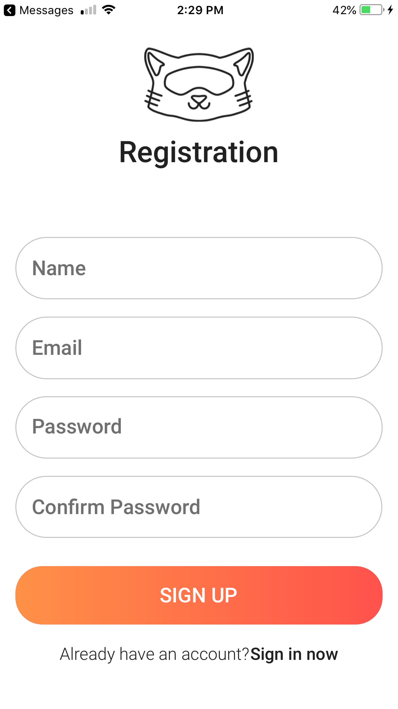
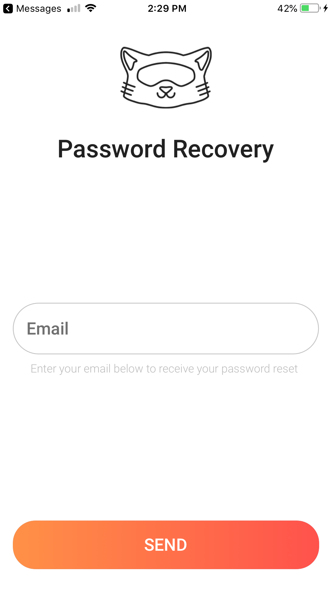
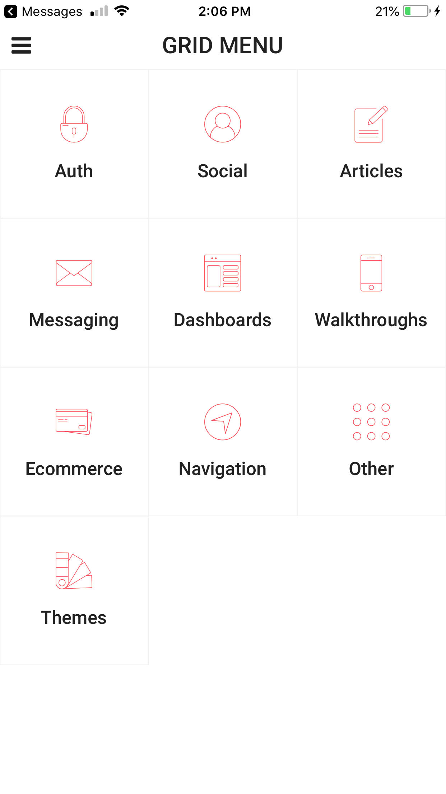
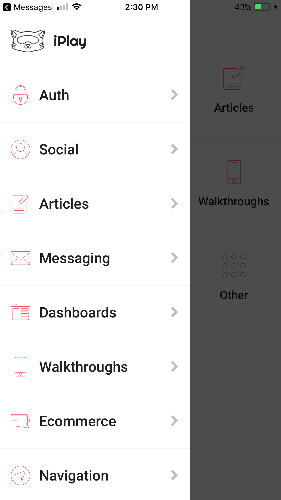

# iPlay

> project repo for iPlay Servers app 

## User Stories:

* As a user, I want to be able to sign up.
* As a user, I want to be able to sign in.
* As a user, I want to be able to launch a new Minecraft PE server (instant).
* As a user, I want to be able to adjust the server's core settings.
* As a user, I want to be able to enable plugins.
* As a user, I want to be able to disable plugins.
* As a user, I want to be able to configure plugins.
* As a user, I want to be able to adjust custom player slots.

## Navigation Sections:

User Account<br>
Server Status<br>
Server Settings<br>
Plugins<br>

## iPlay prototype V1

Auth flow:

<br>
Loading:
<!--  -->

<br>
Log in:
<!--  -->

<br>
Sign up:
<!--  -->

<br>
Password Recovery:
<!--  -->

<br>
Dashboard:
<!--  -->

<br>
Side navbar:
<!--  -->


## How React Native works

React Native lets you build mobile apps using JavaScript. It uses the same design as [React](https://facebook.github.io/react), letting you compose a rich mobile UI from declarative components.

With React Native, you don't build a "mobile web app", an "HTML5 app", or a "hybrid app". You build a real mobile app that's indistinguishable from an app built using Objective-C, Java, Kotlin, or Swift. React Native uses the same fundamental UI building blocks as regular iOS and Android apps. You just put those building blocks together using JavaScript and React.

React Native lets you build your app faster. Instead of recompiling, you can reload your app instantly. With hot reloading, you can even run new code while retaining your application state.

React Native combines smoothly with components written in Objective-C, Java, Kotlin, or Swift. It's simple to drop down to native code if you need to optimize a few aspects of your application. It's also easy to build part of your app in React Native, and part of your app using native code directly - that's how the Facebook app works.

The focus of React Native is on developer efficiency across all the platforms you care about - learn once, write anywhere. Facebook uses React Native in multiple production apps and will continue investing in React Native.

## Quick Overview

Make sure you have Node v6 or later installed. No Xcode or Android Studio installation is required.

```sh
$ npm install
$ npm install -g expo-cli
$ npm start
```

The `npm start` command starts the Expo CLI server. You can now run the project on your phone by using the Expo app.

### Android

- Install the [Expo](https://expo.io) app on your Android device.
- Scan the QR code in your terminal from the Expo app to run the project on your phone.
- Alternatively you can press 's' in the terminal and sign in with an Expo account, and sign in with the same account in the Expo app: your projects will automatically appear in the "Projects" tab.

### iOS

- Install the [Expo](https://expo.io) app on your iOS device.
- Press 'e' in the terminal to send the app link to your email address or phone number. This link can be used to run your project from the Expo app.
- Alternatively you can press 's' in the terminal and sign in with an Expo account, and sign in with the same account in the Expo app: your projects will automatically appear in the "Projects" tab.

Expo CLI allows you to work with all of the [Components and APIs](https://facebook.github.io/react-native/docs/getting-started.html) in React Native, as well as the [JavaScript APIs](https://docs.expo.io/versions/latest/sdk/index.html) that the Expo app provides.